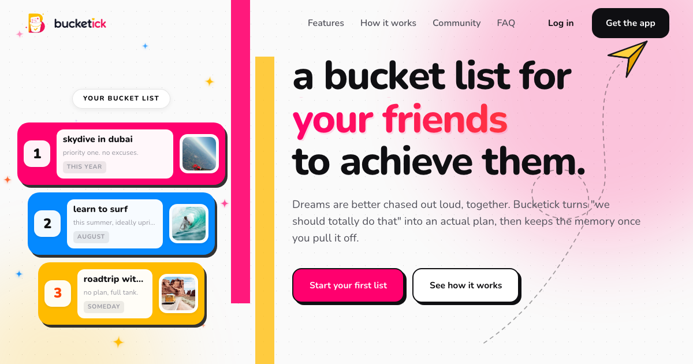

<p align="center" style="background:white;">
  
</p>

<p align="center">
  A social platform where people collect dreams, chase goals together, preserve memories, and inspire each other.<br/>
  Think of it as a positive Instagram: instead of highlight reels, people share the wins they actually pulled off.
</p>

<p align="center">
  
</p>

---

## What Bucketick is

Bucketick is not a to-do app and not a habit tracker. It is a place where goals become
journeys, journeys become memories, and memories inspire other people to stop postponing their
own dreams.

- **Bucket lists** you build alone or with friends, and tick off over time.
- **Achievement posts** ("finally ran my first 10k", "hiked to Everest base camp") with photos,
  captions, **hypes** (the friendly version of likes), comments, shares, and bookmarks.
- **A feed and an Explore gallery** to discover what other people are chasing.
- **A leaderboard** so finishing things actually feels like it counts.

The live marketing site is at **[bucketick.com](https://bucketick.com)**.

---

## What is in this repo

Two things live here: a **Turborepo + Bun monorepo** for the web surfaces and shared packages,
and two **standalone folders** for the mobile app and its backend (kept standalone so Expo and
the server each run with their own tooling, no workspace-symlink friction).

```
bucketick/
├── apps/                     (Turborepo + Bun workspace)
│   ├── landing/     Marketing site, live at bucketick.com. Vanilla Vite (GSAP / Lenis / SplitType), no React.
│   ├── dashboard/   Web dashboard. Vite + React + TypeScript.
│   ├── mobile/      Placeholder README (the real mobile app is bucketick-app below).
│   └── admin/       Placeholder, deferred.
├── packages/
│   ├── design-tokens/  The visual language: CSS variables + Tailwind preset + TS tokens.
│   ├── api-client/     Typed web API client (still stubbed for the web apps).
│   ├── ui/             Shared web components (customized shadcn).
│   ├── tsconfig/       Shared TypeScript configs.
│   └── eslint-config/  Shared lint rules.
│
├── bucketick-app/   Mobile app. Expo + React Native + TypeScript. Wired to bucketick-api.
├── bucketick-api/   Backend. Express + TypeScript + MongoDB (Mongoose) + JWT.
└── docs/            PRD and frontend architecture notes.
```

> Note: `bucketick-app` and `bucketick-api` are self-contained and use `npm`, not the Bun
> workspace. The mobile app copies the design-token values inline so it does not depend on the
> monorepo at build time.

---

## The mobile app (`bucketick-app`)


A colorful, feed-first React Native app: share achievements, chase bucket lists, and cheer
people on.

**Features**
- Onboarding, real signup / login / logout (JWT, tokens stored on device).
- Home **feed** of achievement posts with hype, comment, share, bookmark (infinite scroll).
- **Explore** Pinterest-style masonry gallery, and account **Search**.
- Create **posts** (caption, photos, optional linked list) and **bucket lists** (with cover, items, progress).
- **Profile** with Posts / Lists / Ranks tabs, followers/following, and a leaderboard.

**Stack:** Expo SDK 57, React Native, TypeScript, React Navigation (custom floating tab bar),
**TanStack Query** (server state, infinite scroll, optimistic updates), Zustand (session only),
`lucide-react-native` + `react-native-svg` (icons, no emojis), `expo-image`,
`expo-linear-gradient`, `@expo-google-fonts` (Nunito + Manrope).

See `bucketick-app/README.md` for the full breakdown.

---

## The backend (`bucketick-api`)

Express + TypeScript + MongoDB, JWT auth (access + refresh with 401 auto-refresh), a `{ data }`
response envelope, Zod validation, keyset cursor pagination, and helmet + compression +
rate-limiting for production readiness.

**Endpoints** (under `/api/v1`): auth, users, lists, items, leaderboard, follows, and the social
layer (feed, posts, hype, comments, bookmarks, explore, search).

**Verify with zero setup:** `npm run smoke` runs the entire API end to end against an in-memory
MongoDB (no database needed). `npm run dev:demo` spins up in-memory Mongo, seeds demo data, and
serves the API. See `bucketick-api/README.md`.

---

## Getting started

### Web (monorepo)

```bash
bun install                          # install all workspaces
bun dev                              # run every web app in parallel (turbo)
bun --filter @bucketick/landing dev  # run just the landing site
bun run build                        # build everything to apps/*/dist
```

### Backend

```bash
cd bucketick-api
npm install
npm run dev:demo     # zero-config: in-memory MongoDB, auto-seeded, on http://localhost:8090
# or, with a real database:
cp .env.example .env # set MONGODB_URI (MongoDB Atlas or local), then:
npm run dev
```

Demo login after seeding: `maya@bucketick.com` / `password`.

### Mobile app

Start the backend first, then:

```bash
cd bucketick-app
npm install
cp .env.example .env  # set EXPO_PUBLIC_API_URL to reach the backend
npx expo start        # press i (iOS), a (Android), or scan the QR in Expo Go
```

Backend URL by platform (in `bucketick-app/.env`):
- iOS simulator: `http://localhost:8090`
- Android emulator: `http://10.0.2.2:8090`
- Physical device (Expo Go): `http://<your-computer-LAN-IP>:8090`

---

## Build and deploy

- **Landing** is deployed to **Cloudflare Pages** (bucketick.com), built at the repo root with
  `bunx turbo run build --filter=@bucketick/landing`, output `apps/landing/dist`.
- **Backend** deploys to **Render** with **MongoDB Atlas** (root dir `bucketick-api`, build
  `npm install && npm run build`, start `npm start`, health check `/health`).
- **Mobile** builds with **EAS**: `eas build --profile production --platform android` produces an
  `.aab` for the Play Store (or `--profile preview` for a shareable APK). Point
  `EXPO_PUBLIC_API_URL` at the hosted backend first.

The full step-by-step for the mobile app and backend (icons, EAS, Render, Play Store, plus every
convention and gotcha) lives in `../ProjectDocs/MOBILE_APP_PLAYBOOK.md`.

---

## Design language

Brand colors: Yellow `#ffbb00`, Pink `#ff006e`, plus Orange, Blue, and Purple accents on a warm
cream canvas. Type is Nunito (display) with Manrope (body). Soft layered shadows, playful
gradients, and spring-y motion.

The single source of truth is `packages/design-tokens` for the web; the mobile app mirrors the
same values in `bucketick-app/src/theme`. Change tokens there, not per screen. The web surfaces
lean fully rounded; the mobile app uses slightly trimmed corner radii for a more modern feel.

## Why this shape

The landing page is intentionally **vanilla** (no framework tax, full control over the
scroll-driven animations, Lighthouse budget above 95). Everything else is React (web) or React
Native (mobile). Those runtimes cannot share rendered components, so they share something better:
one design-token vocabulary, so every surface speaks the exact same visual language.
